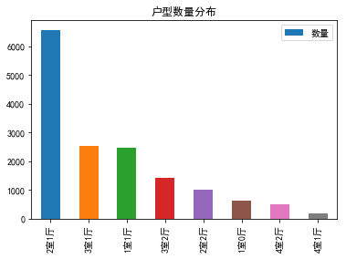
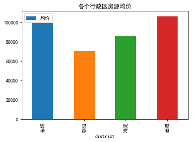
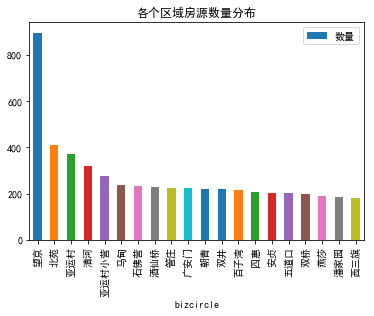
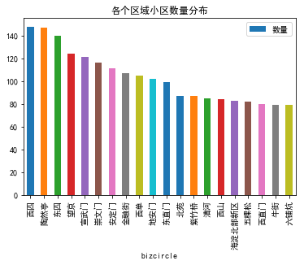
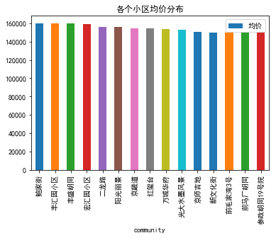

# lianjia-scrawler
+ 该项目提供一个链家网全国房源爬虫工具，数据存储目前支持Mysql,Sqlite和Postgres。非常方便转化成csv等格式文件。
+ 利用Python Pandas ([source code](https://github.com/XuefengHuang/lianjia-scrawler/blob/master/data/lianjia.ipynb))分析链家在线房源数据，本项目提供了一个例子可以参考。
+ 由于链家的反爬虫机制，所以该项目限制了爬虫速度。如果被封，可以修改header的cookie信息。
+ 此[网站](www.sunnyhub.cn)利用该项目爬虫数据做数据可视化分析，欢迎使用！


## 使用说明
+ 下载源码并安装依赖包
```
1. git clone https://github.com/XuefengHuang/lianjia-scrawler.git
2. cd lianjia-scrawler
# If you'd like not to use [virtualenv](https://virtualenv.pypa.io/en/stable/), please skip step 3 and 4.
3. virtualenv lianjia
4. source lianjia/bin/activate
5. pip install -r requirements.txt
6. python scrawl.py
```
+ 设置数据库信息以及爬取城市行政区信息（支持三种数据库格式）
```
DBENGINE = 'mysql' #ENGINE OPTIONS: mysql, sqlite3, postgresql
DBNAME = 'test'
DBUSER = 'root'
DBPASSWORD = ''
DBHOST = '127.0.0.1'
DBPORT = 3306
CITY = 'bj' # only one, shanghai=sh shenzhen=sh......
REGIONLIST = [u'chaoyang', u'xicheng'] # 只支持拼音
```

+ 运行 `python scrawl.py`! (请注释14行如果已爬取完所想要的小区信息)

+ 可以修改`scrawl.py`来只爬取在售房源信息或者成交房源信息或者租售房源信息

+ 该程序提供两种方式爬取房源信息，一个是根据行政区，另一个是根据小区名。 但是根据行政区的只显示前100页的数据，对于像北京朝阳这种房源比较多的区，最好通过小区名才能爬全。具体内容请看下一部分。


## 相关爬虫函数介绍
```
行政区列表：
regionlist = ['chaoyang', 'haidian'] 目前仅支持拼音

小区列表，可通过GetCommunityByRegionlist爬虫得到
communitylist = [u'万科星园', u'上地东里']

根据行政区来爬虫小区信息, 返回regionlist里面所有小区信息。
core.GetCommunityByRegionlist(regionlist)

根据行政区来爬虫在售房源信息， 返回regionlist里面所有在售房源信息。
由于链家限制，仅支持爬前100页数据，可使用GetHouseByCommunitylist。
core.GetHouseByRegionlist(regionlist)

根据小区来爬虫在售房源房源信息，返回communitylist里面所有在售房源信息。
core.GetHouseByCommunitylist(communitylist)

根据行政区来爬虫出租房源信息，返回regionlist里面所有出租房源信息。
由于链家限制，仅支持爬前100页数据，可使用GetRentByCommunitylist。
core.GetRentByRegionlist(regionlist) 

根据小区来爬虫出租房源信息，返回communitylist里面所有出租房源信息。
core.GetRentByCommunitylist(communitylist)

根据小区来爬虫成交房源信息，返回communitylist里面所有成交房源信息。
部分数据无法显示因为这些数据仅在链家app显示
core.GetSellByCommunitylist(communitylist)


```

## 新增[北京建委存放量房源](http://210.75.213.188/shh/portal/bjjs2016/index.aspx)信息爬虫:
+ 代码存放在`jianwei`目录


## 分析北京住城区房源信息

* 导入链家网二手房在售房源的文件（数据更新时间2017-11-29）

```python
import pandas as pd
import numpy as np
import matplotlib.pyplot as plt
from sklearn.cluster import KMeans

import sys

stdout = sys.stdout
reload(sys)
sys.setdefaultencoding('utf-8')
sys.stdout = stdout

plt.rcParams['font.sans-serif'] = ['SimHei']    
plt.rcParams['axes.unicode_minus'] = False

#所有在售房源信息
house=pd.read_csv('houseinfo.csv')

# 所有小区信息
community=pd.read_csv('community.csv')

# 合并小区信息和房源信息表，可以获得房源更详细的地理位置
community['community'] = community['title']
house_detail = pd.merge(house, community, on='community')
```

* 将数据从字符串提取出来


```python
# 将字符串转换成数字
def data_adj(area_data, str):       
    if str in area_data :        
        return float(area_data[0 : area_data.find(str)])    
    else :        
        return None
# 处理房屋面积数据
house['square'] = house['square'].apply(data_adj,str = '平米')
```

* 删除车位信息


```python
car=house[house.housetype.str.contains('车位')]
print '记录中共有车位%d个'%car.shape[0]
house.drop(car.index,inplace=True)
print '现在还剩下%d条记录'%house.shape[0]
```

    记录中共有车位32个
    现在还剩下16076条记录


* 价格最高的5个别墅


```python
bieshu=house[house.housetype.str.contains('别墅')]
print '记录中共有别墅%d栋'%bieshu.shape[0]
bieshu.sort_values('totalPrice',ascending=False).head(5)
```

    记录中共有别墅50栋


<div>
<table border="1" class="dataframe">
  <thead>
    <tr style="text-align: right;">
      <th></th>
      <th>houseID</th>
      <th>title</th>
      <th>link</th>
      <th>community</th>
      <th>years</th>
      <th>housetype</th>
      <th>square</th>
      <th>direction</th>
      <th>floor</th>
      <th>taxtype</th>
      <th>totalPrice</th>
      <th>unitPrice</th>
      <th>followInfo</th>
      <th>validdate</th>
    </tr>
  </thead>
  <tbody>
    <tr>
      <th>8020</th>
      <td>101102078117</td>
      <td>香山清琴二期独栋别墅，毛坯房原始户型，花园1200平米</td>
      <td>https://bj.lianjia.com/ershoufang/101102078117...</td>
      <td>香山清琴</td>
      <td>2层2007年建</td>
      <td>独栋别墅</td>
      <td>NaN</td>
      <td>1002.56平米</td>
      <td>2层2007年建</td>
      <td>房本满五年</td>
      <td>12500</td>
      <td>124681</td>
      <td>45人关注 / 共7次带看 / 2个月以前发布</td>
      <td>2017-11-29 14:31:35</td>
    </tr>
    <tr>
      <th>102</th>
      <td>101100652295</td>
      <td>千尺独栋 北入户 红顶商人金融界入住社区</td>
      <td>https://bj.lianjia.com/ershoufang/101100652295...</td>
      <td>龙湖颐和原著</td>
      <td>2层2010年建</td>
      <td>独栋别墅</td>
      <td>NaN</td>
      <td>1071.32平米</td>
      <td>2层2010年建</td>
      <td>距离4号线西苑站839米房本满五年</td>
      <td>12000</td>
      <td>112012</td>
      <td>231人关注 / 共26次带看 / 一年前发布</td>
      <td>2017-11-29 14:36:53</td>
    </tr>
    <tr>
      <th>2729</th>
      <td>101101641953</td>
      <td>临湖独栋别墅 花园半亩 观景湖面和绿化 满五年有车库房主自荐</td>
      <td>https://bj.lianjia.com/ershoufang/101101641953...</td>
      <td>紫玉山庄</td>
      <td>3层2000年建</td>
      <td>独栋别墅</td>
      <td>NaN</td>
      <td>403.72平米</td>
      <td>3层2000年建</td>
      <td>房本满五年</td>
      <td>6000</td>
      <td>148618</td>
      <td>108人关注 / 共16次带看 / 5个月以前发布</td>
      <td>2017-11-28 16:42:18</td>
    </tr>
    <tr>
      <th>3141</th>
      <td>101101684273</td>
      <td>银湖别墅 独栋 望京公园旁 五环里 封闭式社区</td>
      <td>https://bj.lianjia.com/ershoufang/101101684273...</td>
      <td>银湖别墅</td>
      <td>3层1998年建</td>
      <td>独栋别墅</td>
      <td>NaN</td>
      <td>383.59平米</td>
      <td>3层1998年建</td>
      <td>房本满五年</td>
      <td>5000</td>
      <td>130348</td>
      <td>9人关注 / 共3次带看 / 5个月以前发布</td>
      <td>2017-11-28 15:20:06</td>
    </tr>
    <tr>
      <th>4112</th>
      <td>101101796191</td>
      <td>首排别墅 位置好 全景小区绿化和人工湖 有车库</td>
      <td>https://bj.lianjia.com/ershoufang/101101796191...</td>
      <td>亚运新新家园朗月园一期</td>
      <td>1层2003年建</td>
      <td>联排别墅</td>
      <td>NaN</td>
      <td>461.37平米</td>
      <td>1层2003年建</td>
      <td>房本满五年</td>
      <td>3800</td>
      <td>82364</td>
      <td>0人关注 / 共4次带看 / 4个月以前发布</td>
      <td>2017-11-28 15:34:28</td>
    </tr>
  </tbody>
</table>
</div>


* 删除别墅信息


```python
house.drop(bieshu.index,inplace=True)
print '现在还剩下%d条记录'%house.shape[0]
```

    现在还剩下16026条记录


* 获取总价前五的房源信息


```python
house.sort_values('totalPrice',ascending=False).head(5)
```


<div>
<table border="1" class="dataframe">
  <thead>
    <tr style="text-align: right;">
      <th></th>
      <th>houseID</th>
      <th>title</th>
      <th>link</th>
      <th>community</th>
      <th>years</th>
      <th>housetype</th>
      <th>square</th>
      <th>direction</th>
      <th>floor</th>
      <th>taxtype</th>
      <th>totalPrice</th>
      <th>unitPrice</th>
      <th>followInfo</th>
      <th>validdate</th>
    </tr>
  </thead>
  <tbody>
    <tr>
      <th>8571</th>
      <td>101102105035</td>
      <td>中关村创业大街对过 有名的公司入驻其中正规写字楼</td>
      <td>https://bj.lianjia.com/ershoufang/101102105035...</td>
      <td>银科大厦</td>
      <td>低楼层(共22层)2004年建塔楼</td>
      <td>1房间0卫</td>
      <td>2623.28</td>
      <td>东 南 西 北</td>
      <td>低楼层(共22层)2004年建塔楼</td>
      <td>距离10号线苏州街站898米房本满五年</td>
      <td>12000</td>
      <td>45745</td>
      <td>1人关注 / 共0次带看 / 2个月以前发布</td>
      <td>2017-11-29 14:07:32</td>
    </tr>
    <tr>
      <th>11758</th>
      <td>101102235883</td>
      <td>中关村创业大街对过 有名的公司入驻其中正规一层底商</td>
      <td>https://bj.lianjia.com/ershoufang/101102235883...</td>
      <td>银科大厦</td>
      <td>底层(共22层)2004年建塔楼</td>
      <td>1房间0卫</td>
      <td>1182.80</td>
      <td>东北</td>
      <td>底层(共22层)2004年建塔楼</td>
      <td>距离10号线苏州街站898米房本满五年</td>
      <td>12000</td>
      <td>101455</td>
      <td>0人关注 / 共0次带看 / 1个月以前发布</td>
      <td>2017-11-29 14:07:33</td>
    </tr>
    <tr>
      <th>2480</th>
      <td>101101608106</td>
      <td>西山别墅区拥有900平大花园纯独栋社区房主自荐</td>
      <td>https://bj.lianjia.com/ershoufang/101101608106...</td>
      <td>香山清琴</td>
      <td>1层2007年建</td>
      <td>7室3厅</td>
      <td>482.16</td>
      <td>南 北</td>
      <td>1层2007年建</td>
      <td>房本满五年</td>
      <td>7000</td>
      <td>145181</td>
      <td>94人关注 / 共24次带看 / 6个月以前发布</td>
      <td>2017-11-29 14:31:34</td>
    </tr>
    <tr>
      <th>14492</th>
      <td>101102306092</td>
      <td>盘古大观 大平层 观景房 格局可塑性强！</td>
      <td>https://bj.lianjia.com/ershoufang/101102306092...</td>
      <td>盘古大观</td>
      <td>中楼层(共22层)2007年建塔楼</td>
      <td>3室2厅</td>
      <td>671.35</td>
      <td>东 南 西</td>
      <td>中楼层(共22层)2007年建塔楼</td>
      <td>NaN</td>
      <td>6700</td>
      <td>99799</td>
      <td>16人关注 / 共0次带看 / 13天以前发布</td>
      <td>2017-11-28 15:19:41</td>
    </tr>
    <tr>
      <th>10154</th>
      <td>101102178295</td>
      <td>朝阳公园内建筑，视野好，可以俯视朝阳公园美景</td>
      <td>https://bj.lianjia.com/ershoufang/101102178295...</td>
      <td>霄云路8号</td>
      <td>高楼层(共27层)2011年建塔楼</td>
      <td>4室3厅</td>
      <td>453.64</td>
      <td>南 北</td>
      <td>高楼层(共27层)2011年建塔楼</td>
      <td>房本满两年</td>
      <td>5500</td>
      <td>121242</td>
      <td>39人关注 / 共4次带看 / 1个月以前发布</td>
      <td>2017-11-28 15:52:12</td>
    </tr>
  </tbody>
</table>
</div>


* 获取户型数量分布信息


```python
housetype = house['housetype'].value_counts()
housetype.head(8).plot(kind='bar',x='housetype',y='size', title='户型数量分布')
plt.legend(['数量']) 
plt.show()
```





* 关注人数最多5套房子


```python
house['guanzhu'] = house['followInfo'].apply(data_adj,str = '人关注')
house.sort_values('guanzhu',ascending=False).head(5)
```


<div>
<table border="1" class="dataframe">
  <thead>
    <tr style="text-align: right;">
      <th></th>
      <th>houseID</th>
      <th>title</th>
      <th>link</th>
      <th>community</th>
      <th>years</th>
      <th>housetype</th>
      <th>square</th>
      <th>direction</th>
      <th>floor</th>
      <th>taxtype</th>
      <th>totalPrice</th>
      <th>unitPrice</th>
      <th>followInfo</th>
      <th>validdate</th>
      <th>guanzhu</th>
    </tr>
  </thead>
  <tbody>
    <tr>
      <th>47</th>
      <td>101100379913</td>
      <td>弘善家园南向开间，满两年，免增值税</td>
      <td>https://bj.lianjia.com/ershoufang/101100379913...</td>
      <td>弘善家园</td>
      <td>中楼层(共28层)2009年建塔楼</td>
      <td>1室0厅</td>
      <td>42.64</td>
      <td>南</td>
      <td>中楼层(共28层)2009年建塔楼</td>
      <td>距离10号线十里河站698米房本满两年随时看房</td>
      <td>265</td>
      <td>62149</td>
      <td>1401人关注 / 共305次带看 / 一年前发布</td>
      <td>2017-11-29 09:34:23</td>
      <td>1401.0</td>
    </tr>
    <tr>
      <th>2313</th>
      <td>101101588951</td>
      <td>四惠东 康家园 南向一居室 地铁1号线出行房主自荐</td>
      <td>https://bj.lianjia.com/ershoufang/101101588951...</td>
      <td>康家园</td>
      <td>顶层(共6层)1995年建板楼</td>
      <td>1室1厅</td>
      <td>41.97</td>
      <td>南</td>
      <td>顶层(共6层)1995年建板楼</td>
      <td>距离1号线四惠东站974米房本满五年随时看房</td>
      <td>262</td>
      <td>62426</td>
      <td>1005人关注 / 共86次带看 / 6个月以前发布</td>
      <td>2017-11-28 17:21:58</td>
      <td>1005.0</td>
    </tr>
    <tr>
      <th>990</th>
      <td>101101355617</td>
      <td>远见名苑  东南两居  满五年家庭唯一住房 诚心出售房主自荐</td>
      <td>https://bj.lianjia.com/ershoufang/101101355617...</td>
      <td>远见名苑</td>
      <td>中楼层(共24层)2004年建塔楼</td>
      <td>2室1厅</td>
      <td>90.14</td>
      <td>东南</td>
      <td>中楼层(共24层)2004年建塔楼</td>
      <td>距离7号线达官营站516米房本满五年</td>
      <td>811</td>
      <td>89972</td>
      <td>979人关注 / 共50次带看 / 8个月以前发布</td>
      <td>2017-11-29 10:09:39</td>
      <td>979.0</td>
    </tr>
    <tr>
      <th>2331</th>
      <td>101101590746</td>
      <td>荣丰二期朝南复式无遮挡全天采光房主自荐</td>
      <td>https://bj.lianjia.com/ershoufang/101101590746...</td>
      <td>荣丰2008</td>
      <td>中楼层(共10层)2005年建塔楼</td>
      <td>1室1厅</td>
      <td>32.54</td>
      <td>南</td>
      <td>中楼层(共10层)2005年建塔楼</td>
      <td>距离7号线达官营站1028米房本满五年随时看房</td>
      <td>400</td>
      <td>122926</td>
      <td>972人关注 / 共369次带看 / 6个月以前发布</td>
      <td>2017-11-29 10:08:38</td>
      <td>972.0</td>
    </tr>
    <tr>
      <th>915</th>
      <td>101101327417</td>
      <td>通州万达北苑地铁站 天时名苑 大两居可改3居</td>
      <td>https://bj.lianjia.com/ershoufang/101101327417...</td>
      <td>天时名苑</td>
      <td>顶层(共9层)2009年建板塔结合</td>
      <td>2室2厅</td>
      <td>121.30</td>
      <td>南 北</td>
      <td>顶层(共9层)2009年建板塔结合</td>
      <td>距离八通线通州北苑站602米房本满五年</td>
      <td>645</td>
      <td>53174</td>
      <td>894人关注 / 共228次带看 / 8个月以前发布</td>
      <td>2017-11-29 09:20:13</td>
      <td>894.0</td>
    </tr>
  </tbody>
</table>
</div>


* 户型和关注人数分布


```python
fig, ax1 = plt.subplots(1,1)    
type_interest_group = house['guanzhu'].groupby(house['housetype']).agg([('户型', 'count'), ('关注人数', 'sum')])    
#取户型>50的数据进行可视化
ti_sort = type_interest_group[type_interest_group['户型'] > 50].sort_values(by='户型')    
ti_sort.plot(kind='barh', alpha=0.7, grid=True, ax=ax1)    
plt.title('二手房户型和关注人数分布')    
plt.ylabel('户型') 
plt.show()
```


* 面积分布


```python
fig,ax2 = plt.subplots(1,1)    
area_level = [0, 50, 100, 150, 200, 250, 300, 500]    
label_level = ['小于50', '50-100', '100-150', '150-200', '200-250', '250-300', '300-350']    
area_cut = pd.cut(house['square'], area_level, labels=label_level)        
area_cut.value_counts().plot(kind='bar', rot=30, alpha=0.4, grid=True, fontsize='small', ax=ax2)    
plt.title('二手房面积分布')    
plt.xlabel('面积')    
plt.legend(['数量'])    
plt.show()
```


* 聚类分析


```python
# 缺失值处理:直接将缺失值去掉    
cluster_data = house[['guanzhu','square','totalPrice']].dropna()    
#将簇数设为3    
K_model = KMeans(n_clusters=3)    
alg = K_model.fit(cluster_data)    
'------聚类中心------'   
center = pd.DataFrame(alg.cluster_centers_, columns=['关注人数','面积','房价'])    
cluster_data['label'] = alg.labels_ 
center
```


<table border="1" class="dataframe">
  <thead>
    <tr style="text-align: right;">
      <th></th>
      <th>关注人数</th>
      <th>面积</th>
      <th>房价</th>
    </tr>
  </thead>
  <tbody>
    <tr>
      <th>0</th>
      <td>49.828329</td>
      <td>135.012281</td>
      <td>1139.387478</td>
    </tr>
    <tr>
      <th>1</th>
      <td>48.573579</td>
      <td>256.357676</td>
      <td>2549.974916</td>
    </tr>
    <tr>
      <th>2</th>
      <td>61.465875</td>
      <td>74.495457</td>
      <td>515.516434</td>
    </tr>
  </tbody>
</table>
</div>


* 北京市在售面积最小二手房


```python
house.sort_values('square').iloc[0,:]
```


    houseID                                            101102324602
    title                                      智德北巷（北河沿大街）+小户型一居+南向
    link          https://bj.lianjia.com/ershoufang/101102324602...
    community                                                  智德北巷
    years                                          中楼层(共6层)1985年建板楼
    housetype                                                  1室0厅
    square                                                    15.29
    direction                                                     南
    floor                                          中楼层(共6层)1985年建板楼
    taxtype                                          距离5号线灯市口站1113米
    totalPrice                                                  220
    unitPrice                                                143885
    followInfo                               56人关注 / 共2次带看 / 8天以前发布
    validdate                                   2017-11-29 13:23:16
    guanzhu                                                      56
    Name: 15260, dtype: object


* 北京市在售面积最大二手房


```python
house.sort_values('square',ascending=False).iloc[0,:]
```


    houseID                                            101102105035
    title                                  中关村创业大街对过 有名的公司入驻其中正规写字楼
    link          https://bj.lianjia.com/ershoufang/101102105035...
    community                                                  银科大厦
    years                                         低楼层(共22层)2004年建塔楼
    housetype                                                 1房间0卫
    square                                                  2623.28
    direction                                               东 南 西 北
    floor                                         低楼层(共22层)2004年建塔楼
    taxtype                                     距离10号线苏州街站898米房本满五年
    totalPrice                                                12000
    unitPrice                                                 45745
    followInfo                               1人关注 / 共0次带看 / 2个月以前发布
    validdate                                   2017-11-29 14:07:32
    guanzhu                                                       1
    Name: 8571, dtype: object


* 各个行政区房源均价


```python
house_unitprice_perdistrict = house_detail.groupby('district').mean()['unitPrice']
house_unitprice_perdistrict.plot(kind='bar',x='district',y='unitPrice', title='各个行政区房源均价')
plt.legend(['均价']) 
plt.show()
```





* 各个区域房源数量排序


```python
bizcircle_count=house_detail.groupby('bizcircle').size().sort_values(ascending=False)
bizcircle_count.head(20).plot(kind='bar',x='bizcircle',y='size', title='各个区域房源数量分布')
plt.legend(['数量']) 
plt.show()
```





* 各个区域均价排序


```python
bizcircle_unitprice=house_detail.groupby('bizcircle').mean()['unitPrice'].sort_values(ascending=False)
bizcircle_unitprice.head(20).plot(kind='bar',x='bizcircle',y='unitPrice', title='各个区域均价分布')
plt.legend(['均价']) 
plt.show()
```


* 各个区域小区数量


```python
bizcircle_community=community.groupby('bizcircle')['title'].size().sort_values(ascending=False)
bizcircle_community.head(20).plot(kind='bar', x='bizcircle',y='size', title='各个区域小区数量分布')
plt.legend(['数量']) 
plt.show()
```





* 按小区均价排序


```python
community_unitprice = house.groupby('community').mean()['unitPrice'].sort_values(ascending=False)
community_unitprice.head(15).plot(kind='bar',x='community',y='unitPrice', title='各个小区均价分布')
plt.legend(['均价']) 
plt.show()
```



